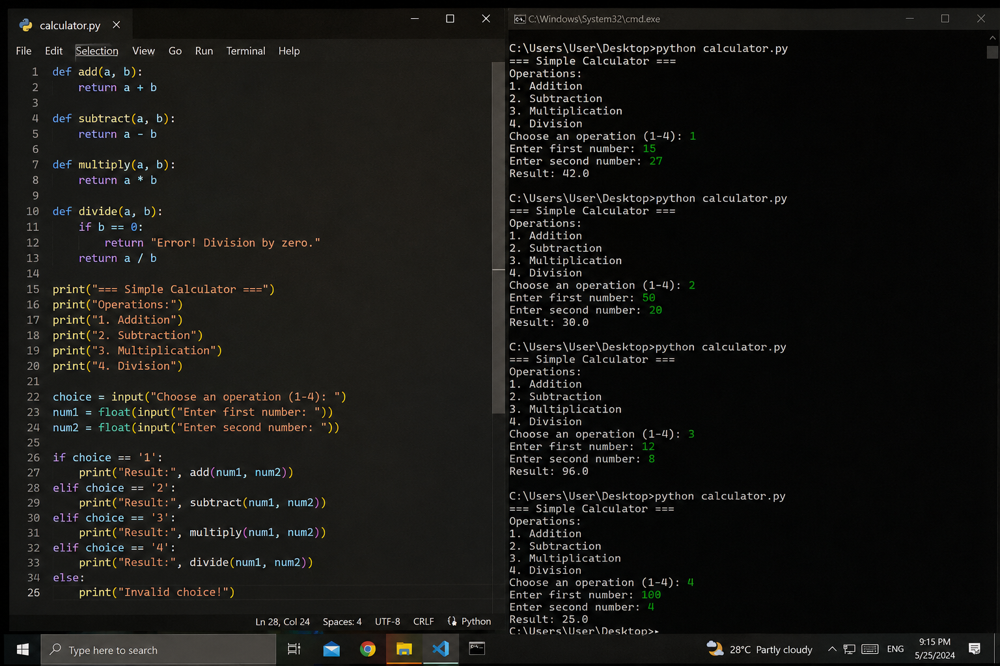

## CpE_Portfolio_Rosal_BSCpE3A

## Personal Information
## Name
Renz kenneth Rosal 
## Course / Section
Bs Com eng

## About me

Hello! I am a Computer Engineering student.
This repository contains my projects, documentation, and activities related to programming and technology.

## Skills

- Basic Programming
- Python Programming
- HTML
- CSS
- Problem Solving

  
## Projects

1. Calculator App
2. Enrollment System Prototype

## Featured Project

## 1. Screen design

## Description 
A simple login screen UI design created for practice in user interface design.

## Technologies used

- UI Design
- Mobile Layout Design

## Project Screenshot

## 2. Calculator program

## Description
A Python calculator program that performs addition, subtraction, multiplication, and division.

## Project Screenshot

## Power supply 
## Description 

A power supply is an electronic device that provides electrical energy to a circuit or electronic equipment.

## Components used
 
- Transformer
- Diodes
- Capacitor
- Voltage Regulator (7805)
- LED Indicator
- Resistor

## Project Screenshot

## Technologies Used

-Python
-HTML
-CSS
-VS Code

